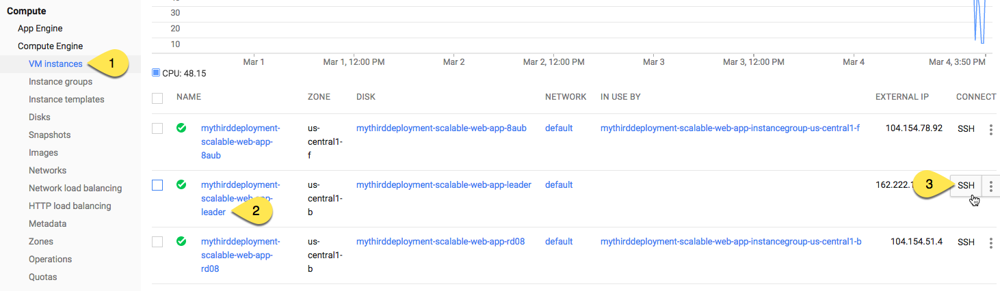

# Scalable and Resilient Web Application on GCP
This repository contains the Deployment Manager templates and Chef recipes required to deploy the solution described in the [Scalable and Resilient Web Applications on Google Cloud Platform]() paper.

Google Deployment Manager is used to provision and configure infrastructure services including instance groups, a load balancer, and a Cloud SQL instance, while Chef is used to install and configure the [Redmine application](http://www.redmine.org) on each of the autoscaled web servers. You may optionally configure the application to use Google Cloud Storage to handle file uploads.

## A Note About Cost
Deploying this sample will create resources that are billed to your account. It is important that you follow the instructions at the end of the tutorial to clean up all resources to prevent ongoing charges. Resources created by this tutorial include:

* (2) x n1-standard-1 GCE instances + associated PD boot disks
* (1) x n1-standard-1 GCE instances + associated PD boot disks that will run for a few minutes to do initial setup then terminate itself
* (1) x D1 Cloud SQL instance
* (1) x HTTP load balancer forwarding rule

See the [Pricing Section]() of the solution page for more details on esimated charges.

To reduce costs, you can modify the Deployment Manager templates to provision smaller machine types, or adjust the Cloud SQL instructions to use a smaller database type.

## Deployment Requirements
Before you deploy the sample you'll need to make sure a few things are in order:

1. In the [APIs & Auth section of the Google Developers Console](https://console.developers.google.com/project/_/apiui/api), enable the Compute Engine API, Google Cloud SQL API, and Google Compute Engine Instance Group Manager API. When prompted choose an existing project or create a new project.
2. Install the Cloud SDK using [these instructions](https://cloud-dot-devsite.googleplex.com/sdk/).
3. Authenticate to gcloud:

        $ gcloud auth login

4. Set your project:

        $ gcloud config set project YOUR_PROJECT_ID

5. Enable preview features:

        $ gcloud components update preview

## Deploy the Sample
With `gcloud` installed and the proper APIs configured, you're ready to go.

1. Clone this repository.
2. Create a Cloud SQL database:

        $ DB_NAME=YOUR_DB_NAME

        $ gcloud sql instances create $DB_NAME \
          --assign-ip \
          --authorized-networks "0.0.0.0/0" \
          --gce-zone us-central1-f \
          --pricing-plan PACKAGE \
          --require-ssl \
          --replication SYNCHRONOUS \
          --quiet \
          --tier D1

3. Set the root password for your database:

        $ gcloud sql instances set-root-password $DB_NAME \
          --password YOUR_PASSWORD

4. Retrieve the IP address of your database:

        $ gcloud sql instances describe $DB_NAME | grep ipAddress

5. Open file `dm/deployment.yaml`, replacing the `host` property with the IP address retrieved above, the `password` property with the value you set previously, and the name of your database:

        ...
        properties:
        database:
            host: #Replace with your database's IP address
            password: #Replace with your own strong password
            instance_name: #Replace with your database's name
        ...

6. **Optional**: If you want to use Google Cloud Storage to store files uploaded to Redmine, which is required for production environments, follow [these instructions](https://cloud.google.com/storage/docs/migrating#keys) to create an access key and secret key for your application, and then paste those values into `dm/deployment.yaml`, replacing the `disabled` values:
    
        properties:
            database:
                ...
                gcs_access_key: disabled #Replace
                gcs_secret: disabled #Replace

7. Deploy the solution:

        $ gcloud preview dm-v2 deployments \
            create YOUR_DEPLOYMENT_NAME \
            --config dm/deployment.yaml

8. Wait until the deployment status is done:

        Waiting for create operation operation-1418683534250-41771e4b-ba9c-4c09-aba3-553ccb8ec5f1 to complete...done.
        Create operation operation-1418683534250-41771e4b-ba9c-4c09-aba3-553ccb8ec5f1 completed successfully.

9. In the Developers Console open **HTTP load balancing**, then find and click on your new load balancer:

    

10. Wait until both instances are healthy.

    > **What's happening while you wait?** Chef is downloading, compiling, and installing Ruby, along with the Redmine application and all of its Gem dependencies on each of the web server instances. Additionally, a special leader instance will apply the database schema, and create SSL keys for the database connection (storing them in Google Cloud Storage for the web servers to download and use for their connections). 

    > The process should take about 155555 minutes to complete. While you wait, locate the special leader instance in the Developers console and SSH to it:

    > 

    > From the leader instance's console, tail the log:

    >         $ tail -f /var/log/startupscript.log

    > When the process is complete, you'll see a line indicating the startup script finished running:

    > 

11. When both instances are healthy, click on the IP address of your forwarding rule to view the running app:

    

