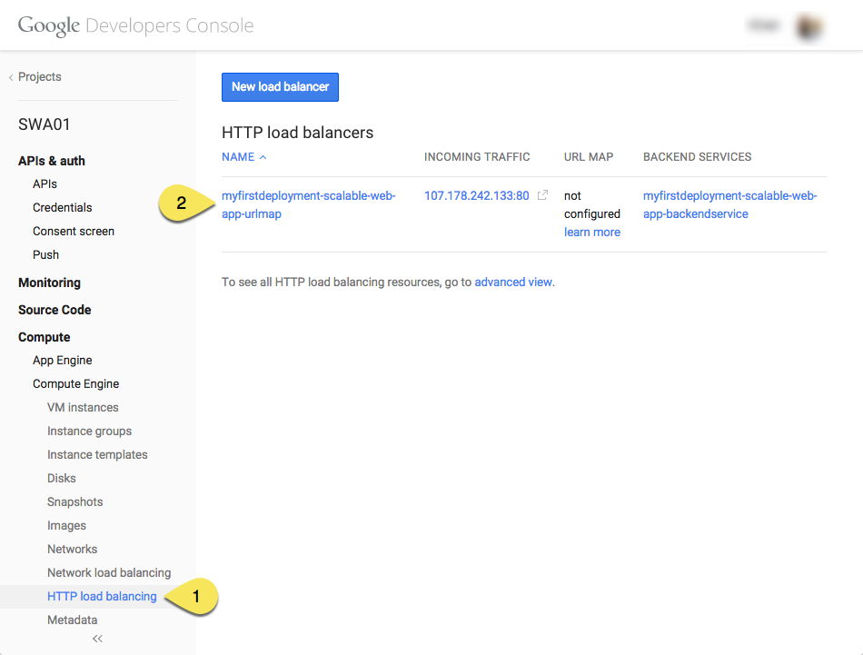
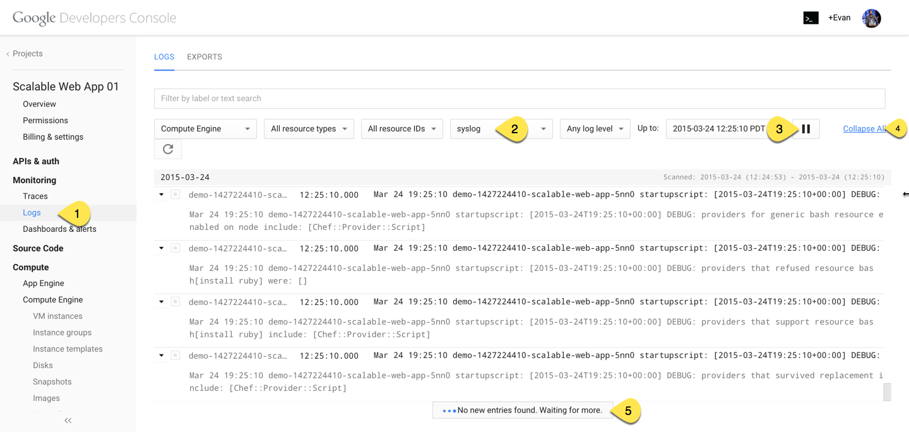
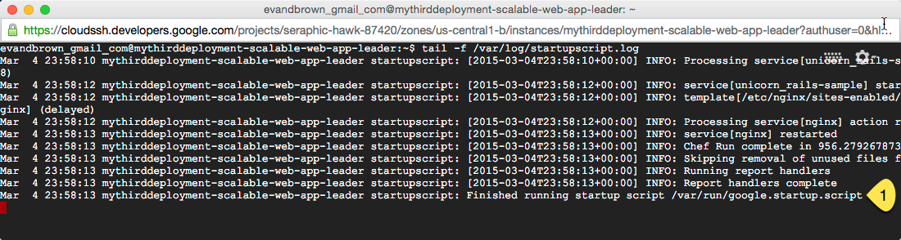
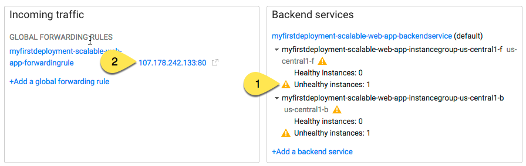
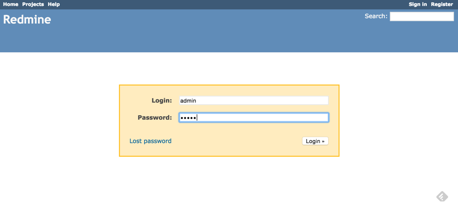
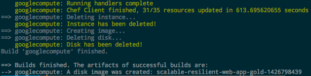
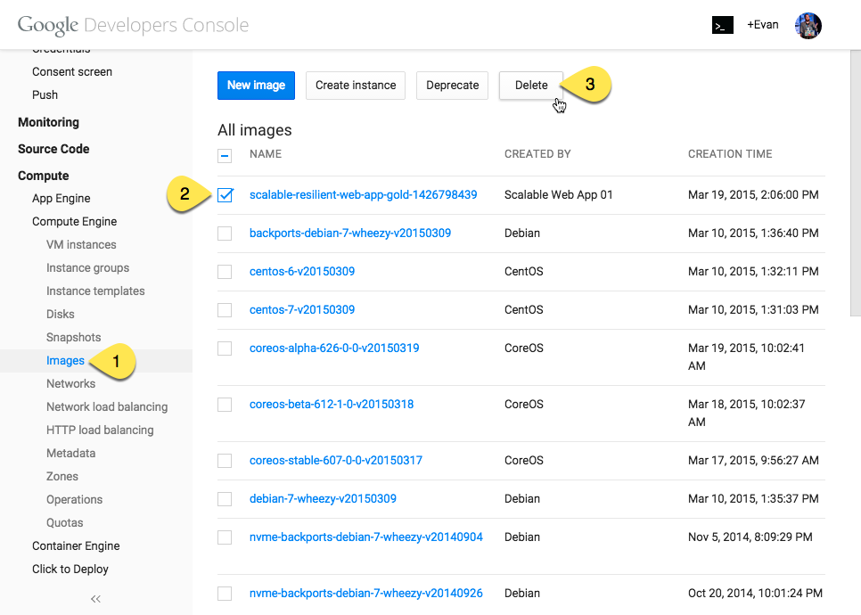

# Scalable and Resilient Web Application on GCP
This repository contains the Deployment Manager templates and Chef recipes required to deploy the solution described in the [Scalable and Resilient Web Applications on Google Cloud Platform](http://cloud.google.com/solutions/scalable-and-resilient-apps) paper.

Google Deployment Manager is used to provision and configure infrastructure services including instance groups, a load balancer, and a Cloud SQL instance, while Chef is used to install and configure the [Redmine application](http://www.redmine.org) on each of the autoscaled web servers. You may optionally configure the application to use Google Cloud Storage to handle file uploads.

## A Note About Cost
Deploying this sample will create resources that are billed to your account. It is important that you follow the instructions at the end of the tutorial to clean up all resources to prevent ongoing charges. Resources created by this tutorial include:

* (2) x n1-standard-1 GCE instances + associated PD boot disks
* (1) x n1-standard-1 GCE instances + associated PD boot disks that will run for a few minutes to do initial setup then terminate itself
* (1) x D1 Cloud SQL instance
* (1) x HTTP load balancer forwarding rule

See the Cost section the [solution page](http://cloud.google.com/solutions/scalable-and-resilient-apps) for more details on estimated charges.

To reduce costs, you can modify the Deployment Manager templates to provision smaller machine types, or adjust the Cloud SQL instructions to use a smaller database type.

## Deployment Requirements
Before you deploy the sample you'll need to make sure a few things are in order:

1. In the [APIs & Auth section of the Google Cloud Console](https://console.developers.google.com/project/_/apiui/api) create a new project and enable the following APIs:

    * Google Compute Engine
    * Google Cloud SQL API
    * Google Cloud Deployment Manager V2 API

1. Install the Cloud SDK using [these instructions](https://cloud.google.com/sdk/).

1. Authenticate to gcloud:

        $ gcloud auth login

1. Set your project:

        $ gcloud config set project YOUR_PROJECT_ID

## Deploy the Sample
With `gcloud` installed and the proper APIs configured, you're ready to go.

1. Clone this repository or download and unzip a [copy from Releases](https://github.com/GoogleCloudPlatform/scalable-resilient-web-app/releases).

1. Create a variable to hold a unique name for this deployment:

        $ export DEMO_PROJECT=demo-$(date +%s)

1. Create a variable to hold a unique name for your database:

        $ export DB_NAME=$DEMO_PROJECT-db

1. Create a Cloud SQL database:

        $ gcloud sql instances create $DB_NAME \
          --assign-ip \
          --authorized-networks "0.0.0.0/0" \
          --gce-zone us-central1-f \
          --pricing-plan PACKAGE \
          --require-ssl \
          --replication SYNCHRONOUS \
          --quiet \
          --tier D1

1. Set the root password for your database:

        $ gcloud sql users create root '%' -i $DB_NAME \
            --password YOUR_PASSWORD

1. Retrieve the Instance Name and IP address of your database: 

        $ gcloud sql instances describe $DB_NAME --format 'value(name)'
        $ gcloud sql instances describe $DB_NAME --format 'value(ipAddresses[0].ipAddress)'

1. Open file `dm/deployment.yaml`, replacing the `name` and `address` properties with the values retrieved in the previous step, and the `password` property with the value you set previously:

        ...
        properties:
        database:
            name: #Replace with your database's name
            address: #Replace with your database's IP address
            password: #Replace with your own strong password
        ...

1. **Optional**: If you want to use Google Cloud Storage to store files uploaded to Redmine, which is required for production environments, follow [these instructions](https://cloud.google.com/storage/docs/migrating#keys) to create an access key and secret key for your application, and then paste those values into `dm/deployment.yaml`, replacing the `disabled` values:
   
        properties:
            database:
                ...
            gcs_access_key: disabled #Replace
            gcs_secret: disabled #Replace

1. Deploy the solution:

        $ gcloud deployment-manager deployments \
            create $DEMO_PROJECT \
            --config dm/deployment.yaml

1. Wait until the deployment status is done:

        Waiting for create operation operation-1418683534250-41771e4b-ba9c-4c09-aba3-553ccb8ec5f1 to complete...done.
        Create operation operation-1418683534250-41771e4b-ba9c-4c09-aba3-553ccb8ec5f1 completed successfully.

1. In the Cloud Console open **Load balancing**, then find and click on your new load balancer:

    

1. Wait until both instances are healthy.

    > The process should take about 15 minutes to complete. **What's happening during that time?** Chef is downloading, compiling, and installing Ruby, along with the Redmine application and all of its Gem dependencies on each of the web server instances. In short, each instance is being fully bootstrapped. You can speed the boot time up considerably by creating a custom GCE image and pre-installing the components that take the most time. Check out the [Fast Boot with Packer](#fast) section for instructions on this approach.
    
    > Additionally, a special leader instance will apply the database schema, and create SSL keys for the database connection (storing them in Google Cloud Storage for the web servers to download and use for their connections).
    
1. All instances stream their logs to [Google Cloud Logging](https://cloud.google.com/logging/docs). While you wait, navigate to the Logs section, choose `syslog`, click the play icon, then click Expand All to stream them to your browser:

    > 

    > When the process is complete, you'll see a line indicating the startup script finished running:

    > 

1. When both instances are healthy, click on the IP address of your forwarding rule to view the running app:

    

1. You can sign into Redmine using the application's default credentials (username=admin, password=admin, described in more detail on the official [Redmine installation page](http://www.redmine.org/projects/redmine/wiki/RedmineInstall)):

    

## Delete the Sample
It is very important that you follow these instructions if you deployed a sample. If you do not delete the deployment you will continue to be charged for it.

To delete your sample deployment:

1. Delete all objects in the bucket created by your sample deployment:

        $ gsutil rm -r gs://$(gcloud deployment-manager resources list --deployment $DEMO_PROJECT | grep storage.v1.bucket | cut -d' ' -f1)/*

1. Delete your SQL database:

        $ gcloud sql instances delete $DB_NAME

1. Finally, delete your deployment:

        $ gcloud deployment-manager deployments delete $DEMO_PROJECT

## Fast Boot with Packer
The majority of the ~15 minute boot time is consumed by Chef downloading, compiling, and installing Ruby and some other dependencies. And this happens every time an instance boots. You can dramatically improve boot times by building a custom GCE image once, then deploying from that image. In this section we'll use [Packer](http://www.packer.io) to build a custom image using our existing Chef recipes, then modify the Deployment Manager templates to use that image.

1. Download and install Packer from [https://packer.io/downloads.html](https://packer.io/downloads.html)

1. Follow the instructions in the 'Running Without A Compute Engine Service Account' section of [https://packer.io/docs/builders/googlecompute.html](https://packer.io/docs/builders/googlecompute.html) for configuring authentication between Packer on your workstation and your GCE account.

1. Open `packer.json` and replace YOUR_PROJECT_ID with your project ID (you can run `gcloud config list project` to find your project ID)

1. Build the image:

        $ packer build packer.json

    This will take ~10 minutes to complete. Packer will use Chef to execute the `default`, `user`, `ruby`, and `app` recipes on a GCE instance, and then create a reusable image from that running instance. You should see output similar to:

    

1. Use `gcloud` to retrieve the URI of the image. The regexp will filter using the image prefix Packer created the image with:

        $ gcloud compute images list --regexp ^scalable-resilient-web-app-gold-[0-9]+$ --uri

1. Modify the `dm/deployment.yaml` to "fast boot" (simply changing the `mode` attribute from 'default' to 'fast') and use the image URI you retrieved in the previous step:
        
        image:
          mode: fast
          ... 
          fast:
            image: https://www.googleapis.com/compute/v1/projects/peppy-hexagon-87420/global/images/scalable-resilient-web-app-gold-1426798439 
            chef_node_url: https://storage.googleapis.com/solutions-public-assets/scalable-resilient-web-apps/dist/node_fast.json
            chef_cookbook_url: https://storage.googleapis.com/solutions-public-assets/scalable-resilient-web-apps/dist/chef-solo.tar.gz        

1. Follow all steps from the earlier [**Deploy the Sample**](#deploy) section to create a new deployment. This includes setting environment variables and creating a Cloud SQL database.

1. When you're done, follow steps in [**Delete the Sample**](#delete) to delete your deployment.

1. Finally, delete the custom image you created with Packer from the Images section of the Cloud Console:

    

